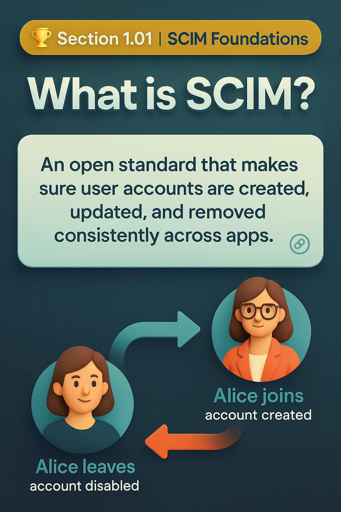

# 🏆 Section 1.1 | Foundations | “What is SCIM?”

---

## 📌 At a glance
SCIM (System for Cross-domain Identity Management) is an **open standard** that makes sure user accounts are created, updated, and removed consistently across different applications.  

Think of it as a **universal language for identity data**, instead of every app speaking its own dialect, they all agree to speak SCIM.  

---

## 📖 What is SCIM?
SCIM defines **how identity data looks** (attributes like `userName` and `emails`) and **how it moves** (messages like “create this user” or “disable this account”).  

- RFC 7643 → what identity data looks like (the schema).  
- RFC 7644 → how identity data is exchanged (the protocol).  
- Two main resources → **Users** and **Groups**.  
- Adopted by major SaaS vendors → Salesforce, Slack, Zoom, Okta, Entra ID.  

---

## 🌟 How SCIM works in practice

### Alice joins the company
1. HR adds Alice in Workday (HR system).  
2. The Identity Provider (IdP), like Okta or Azure AD, notices the new record.  
3. The IdP sends a SCIM **create user request** (`POST /Users`).  
4. Zoom (the app) receives the request and automatically creates Alice’s account.  

### 🌟 ASCII flow
```
HR System ──> IdP ──(SCIM POST /Users)──> Application
```

### 🌟 When Alice leaves
- HR marks Alice as terminated.  
- IdP sends SCIM **disable request** (`PATCH active:false`).  
- Zoom disables Alice’s account instantly.  

👉 No IT tickets. No orphaned accounts. No delays.  

---

## 📖 Glossary
- **IdP (Identity Provider)** → system that manages identity data (Okta, Entra ID).  
- **SP (Service Provider)** → app you want access to (Salesforce, Zoom).  
- **Provisioning** → creating accounts.  
- **Deprovisioning** → disabling or removing accounts.  
- **Schema** → the agreed structure of identity data.  

---

## ❗ Problem before SCIM
- Each app needed a custom connector.  
- Attribute mismatches caused confusion (e.g., “John.Smith” vs “jsmith”).  
- Manual IT tickets → onboarding took days.  
- Orphaned accounts after offboarding → security and compliance gaps.  

---

## 🔑 Key characteristics
### 1. How data looks  
- **Schemas** → standard attributes like `userName`, `emails`, `groups`.  

### 2. How systems talk  
- **REST + JSON** → simple, lightweight, easy to debug.  

### 3. How it helps  
- **Automation-first** → reduces IT workload.  
- **Lifecycle support** → handles joiners, movers, leavers.  
- **Interoperability** → one connector works for many apps.  
- **Secure deprovisioning** → clean account removal.  

---

## 🌍 Why it matters
- **IAM relevance**: SCIM is the modern standard for provisioning.  
- **Governance**: Automates offboarding, closes compliance gaps.  
- **Security**: Prevents ex-employee access.  
- **Audit readiness**: Every identity change is logged.  
- **Career**: SCIM expertise is a must for IAM and cloud security roles.  

---

## 🛠️ Typical lifecycle in action
- **Joiner** → `POST /Users`  
- **Mover** → `PATCH /Users`  
- **Leaver** → `PATCH active:false` or `DELETE /Users`  

❌ Without SCIM → delays, errors, orphaned accounts.  
✅ With SCIM → real-time provisioning, consistency, compliance.  

---

## ⚙️ (Optional) Technical deep dive
*Skip this if you’re new — this is for readers who want to see the raw SCIM calls.*  

### Minimal user creation
```http
POST /Users
{
  "schemas": ["urn:ietf:params:scim:schemas:core:2.0:User"],
  "userName": "jane.doe",
  "name": { "givenName": "Jane", "familyName": "Doe" },
  "emails": [{ "value": "jane.doe@example.com", "primary": true }]
}
```

➡️ Plain English: “Create a user Jane Doe with this email.”  

---

## 🏢 Real-world example
Before SCIM:  
- IT manually created 3,000 accounts per month, taking 3–5 days.  
- 8% of ex-employees still had active accounts.  

After SCIM:  
- Offboarding took under 10 minutes across 15 apps.  
- Compliance audit passed, IT workload reduced by 70%.  

---

## ❌ Common pitfalls
- Forgetting the `schemas` field.  
- Assuming all vendors support `PATCH` (some only use PUT).  
- Using `DELETE` instead of `active:false` → audit trail lost.  
- Case-sensitive `userName` mismatches.  

---

## ⚠️ Risks & issues

| Risk | Impact | Fix |
|------|--------|-----|
| Partial SCIM support | Requests may fail silently | Check `/ServiceProviderConfig` |
| Attribute mismap | Wrong access granted | Test with pilot users |
| Failed deprovision | Orphaned accounts | Monitor logs, retry |
| Overuse of DELETE | Permanent data loss | Prefer `active:false` |

---

## 📝 Mini quiz
1. What main problem does SCIM solve?  
   a) Password sync  
   b) Standardizing provisioning across apps  
   c) Encrypting data at rest  
   d) MFA  

2. Which RFC defines SCIM protocol operations?  
   a) RFC 7643  
   b) RFC 7644  
   c) RFC 5280  
   d) RFC 6749  

3. Why use `active:false` instead of `DELETE`?  
   a) Saves space  
   b) Keeps audit trail while disabling accounts  
   c) Improves API speed  
   d) Automatically archives data  

---

## 🎤 Interview prep questions
1. **Explain the role of SCIM in the joiner–mover–leaver lifecycle. Why is deprovisioning critical from a security standpoint?**  
2. **How does SCIM differ from using a vendor’s custom API for provisioning, and what advantages does SCIM provide in an enterprise environment?**

---

## 🔗 Navigation
👉 Back: [README](../README.md)  
👉 Next: [1.02 SCIM Architecture](1.02-scim-architecture.md)  
